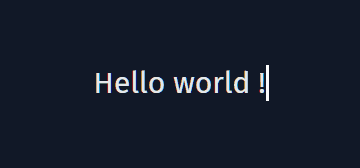

# use-typing-animation

<p align="center">
Allows you to create a typing animation on any HTML element by providing a list of sentences to display.
</p>

<p align="center">
    
</p>

## Installation

```
npm i @mansartesteban/use-typing-animation
```

## Usage

Be careful to verify if the element you pass as argument of `animate` method is defined !

```js
    import useTypingAnimation from "@mansartesteban/use-typing-animation"

    let container = document.getElementById("element-to-animate")

    const list = [
        "Hello world !",
        "Goodbye alone",
    ]

    if (container) {
        useTypingAnimation(list).animate(container)
    }
```